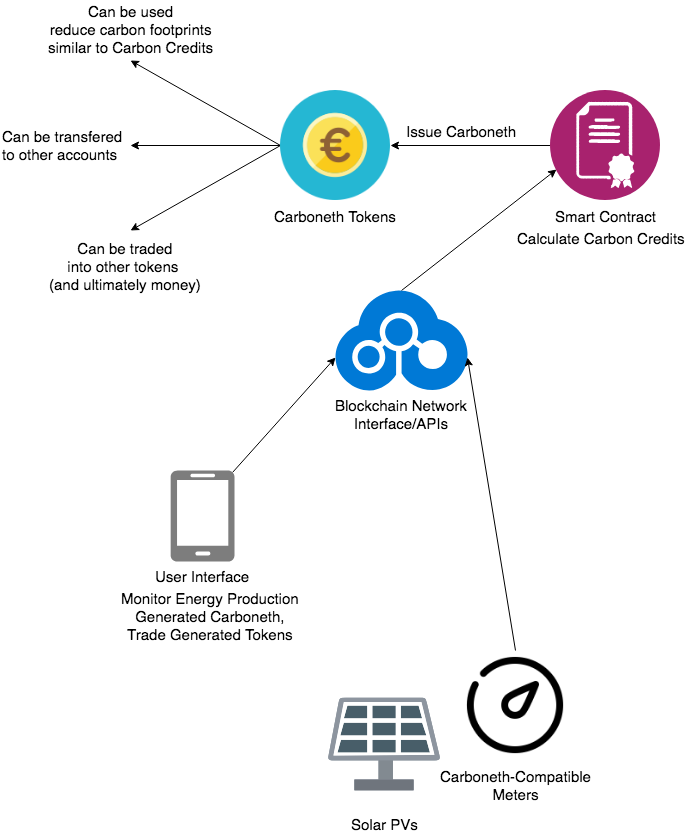
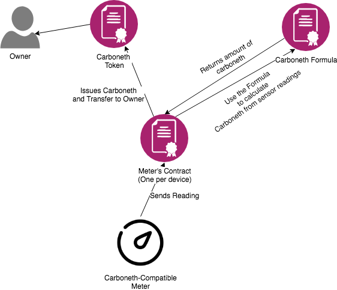

# Carboneth: Modernized Carbon Credits

*Carboneth* is a blockchain-based approach to automate the process of Carbon Credits Evaluations while maintaining transparency and integrity.

## Introduction

**Carbon Credits** is a concept of tradable certificates representing the right to emit one tonne of carbon dioxide (or GHG with a carbon dioxide equivalent).

Carbon Credits are created for each Clean Development Mechanism (CDM) projects. To turn one renewable energy project into a CDM project, the project
needs to be evaluated and verified by a third party trusted by the UNFCC, called the Designated Operational Entity (DOE). 
The evaluation and verification process takes huge amount of time and resources (up to ten thousands of dollars) as the project needs to be rigorously checked. This discourages project owners to register their projects to claim carbon credits, which is not much sensible since Carbon Credits were supposed to encourage clean energy projects.

## Solution

### Overview

**Carboneth** digitizes carbon credits into tokens on blockchain platforms. 
Carboneths represents carbon credits in digital form on the blockchain.
Carboneths can only be issued by **carboneth-compatible meters** which have their identity embed within their very own core, and need to be verified by DOEs after being manufactured before being distributed to project owners. 

When the meters reads energy production, it sends its readings to the blockchain network which then triggers the code that calculates and issues the carbon credits based on the readings, then transfer the created token to the owner of the meter (configured by the project owner).

For simplicity, **carboneth-compatible meters** are only targeted for Solar PVs.

Everything, including the carbon credit calculation formula, the calculation itself, the sensor readings, the list of meters that are able to issue carboneths, are publicly visible on the blockchain. If anyone want to verify the issuances happening at any point in time, they can inspect the transactions on the chain itself.

## Technical Details on the PoC version

### Overview

The PoC version of the protocol is implemented on ethereum. The Carboneth Token is an ERC20 token implemented using simple Solidity contract.

Multiple instances of contracts are involved in the carboneth issuing process. Each carboneth meter has their own instance of special contract,
whose address is on the whitelist of addresses that are able to issue carboneth tokens. The meter periodically sends its readings to the contract associated to it.

There are contracts that act as formulas to convert meter readings into carboneth. For example: the `SolarPVCarbonCreditFormula` applies the basic formula the converts energy produced from PVs into carbon credits. Everyone can always see how the formula looks like and verify if they are correct.

The meter's contract will send all received readings to perform the calculation using the formula it is associated to, then send a command to issue Carboneth tokens and transfer to its owner.

## Possible Questions

### 1. Why aren't we using the IXO blockchain?

We did take time to try to work with the IXO blockchain, and we do see the value within it. However, it is still in earlier stage and does not have a lot of tools and community support. In the end we decided to implement the Proof-of-Concept version on ethereum because it would let us move faster and demonstrate our ideas easier.

### 2. How do we proof that the energy production the meter is attached to is a genuine, renewable energy production (for example, real solar PVs)?

We believe there is no way to automatically prevent fake carbon credit claims. The best way to prevent fake claims is to make faking claims so difficult that it isn't worth trying. There are some ideas to verify the 
integrity of renewable energy, for example, for example checking the serial numbers of some components in 
solar PV panels.

### 3. How do third parties verify carboneth issuances?

All information that leads to the issuances, including the sensor readings, the calculation, the formula used
to derive carboneth outcome and the source of the readings. Anyone can always inspect the events on the chain, 
and verify the transactions however they want.

### 4. Do we aim to replace SolarCoin?

No. We see SolarCoin as a very trustworthy source of solar energy production data. People who acquire SolarCoin by producing solar energy deserves to get carbon credits (carboneth) too. It is very likely that we make our solution compatible with SolarCoin during actual execution.